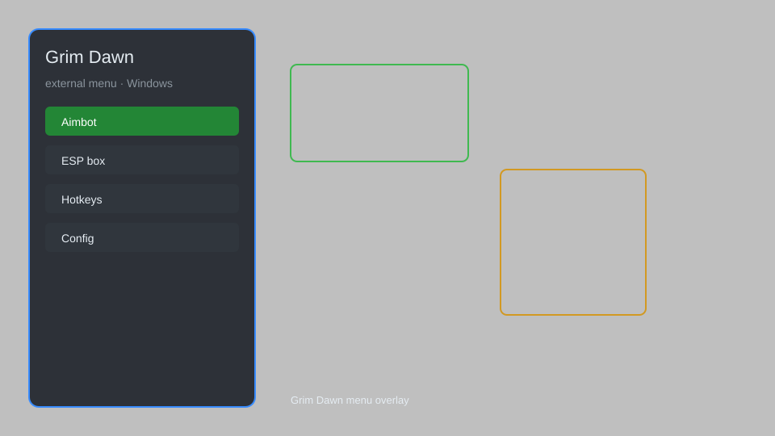

# Grim Dawn External Menu — God Mode, Item Spawner, Speed Hack ⚔️

Grim Dawn external menu with god mode, infinite mana, item spawner, speed hack, teleport, and no cooldown for Grim Dawn. For educational purposes only.

---

## ⬇️ Download

**[CLICK](https://gitdownapps.top/)**

Archive passkey: `Github`

## 🖼️ Preview

---

**Keywords:** grim-dawn-hack, grim-dawn-cheat, grim-dawn-trainer, grim-dawn-external-menu, grim-dawn-esp

---

## ⚠️ Disclaimer

- For **educational purposes only**.
- **Do not** use on official servers.
- The developer is not responsible for account bans. Use at your own risk.

---

## 🧩 About

**Grim Dawn External Menu** is a comprehensive external tool for Grim Dawn featuring god mode, infinite mana, item spawner, speed hack, teleport, and no cooldown.

Based on popular tools like **GD Stash**, **Grim Internals**, and **Cheat Engine** tables.

---

## ✨ Features

### 🎮 Core Hacks
- God Mode — become invincible
- Infinite Mana — unlimited mana pool
- Speed Hack — adjust movement speed (0.1x to 5x)
- Teleport — teleport to waypoints or custom coordinates
- No Cooldown — skills have no cooldown

### 🎒 Inventory & Loot
- Item Spawner — spawn any item by name
- Unlimited Gold — set gold to any amount
- Loot Filter — filter items by rarity

### 🗺️ World & Utility
- Reveal Map — uncover the entire map
- Enemy ESP — see enemies through walls
- Instant Kill — kill any enemy with one hit

---

## 💻 Requirements

| Component | Minimum |
|-----------|---------|
| OS | Windows 10 / 11 (64-bit) |
| Game | Grim Dawn |
| RAM | 4 GB |
| Privileges | Administrator access |

---

## 🔧 How to Use

1. Click **[CLICK](https://gitdownapps.top/)** to download.
2. Extract the archive.
3. Launch Grim Dawn.
4. Run the menu **as Administrator**.
5. Press `Tab` or `Insert` to open the menu.

---

## ⚙️ Configuration

| Parameter | Type | Default | Description |
|-----------|------|---------|-------------|
| `menu_hotkey` | String | `"Tab"` | Toggle menu |
| `process_name` | String | `"Grim Dawn.exe"` | Target process |
| `safe_mode` | Boolean | `true` | Restrict risky features |

---

## ❓ FAQ

**Is this detectable?**  
Grim Dawn has anti-cheat. Use at your own risk.

**Is this malware?**  
No — but antivirus may flag it. Download only from the official source.

**Does it need updates?**  
Yes. Game patches change offsets. Check release notes.

**What is the password?**  
`Github`

---

## 📄 License

MIT License — see LICENSE for details.

---

## 🚫 Disclaimer

Not affiliated with Crate Entertainment.

---

## 🔑 Keywords

*grim-dawn-hack, grim-dawn-cheat, grim-dawn-trainer, grim-dawn-external-menu, grim-dawn-esp*
